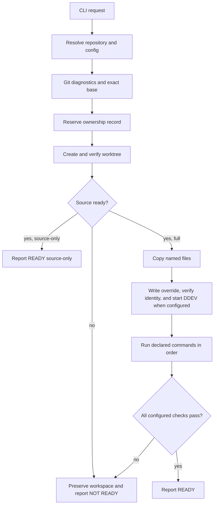
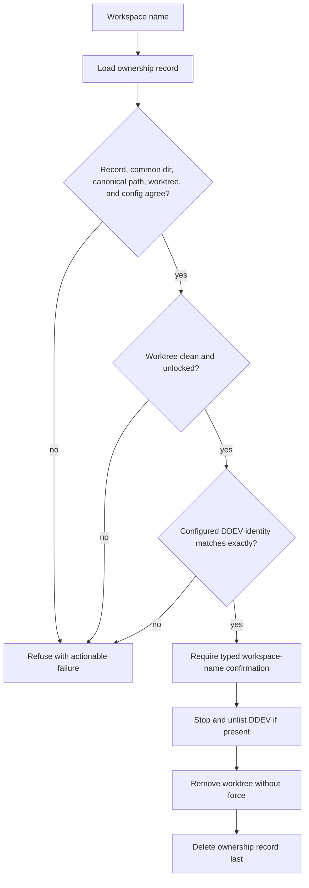

# ddev-workspaces Local CLI - Plan

## Goal Capsule

- **Objective:** A developer can create a trustworthy isolated workspace from a mixed local Git repository and know whether its source and development runtime are ready.
- **Means:** Build one stable-Rust binary with four commands, one small project configuration file, Git-owned workspace records, explicit preparation steps, and exact DDEV identity checks.
- **Authority:** User requirements and safety constraints override this plan; current Git and DDEV evidence constrains command behavior; project configuration controls project-specific preparation.
- **Execution profile:** Implement and test locally with temporary fixture repositories and fake external commands. Do not exercise real pilot projects until automated verification passes.
- **Stop conditions:** Stop before destructive cleanup when ownership, canonical paths, Git identity, DDEV identity, or user confirmation is missing.
- **Tail ownership:** The implementer owns Rust tests, documentation, and exact cleanup of the two approved disposable pilots. The pilots use no production credentials, databases, uploads, snapshots, or existing DDEV registrations.

---

## Product Contract

### Summary

`ddev-workspaces` is a standalone local CLI for creating and managing safe Git worktree development environments. It separates tracked-source correctness from full runtime readiness, runs only project-declared preparation, gives every managed workspace a unique DDEV identity, and refuses ambiguous cleanup.

### Problem Frame

Fresh Git worktrees usually contain the correct tracked tree, but they often lack ignored environment files, dependencies, generated assets, initialized submodules, databases, uploads, and a correctly bound DDEV environment. Existing checkouts also contain stale branches, hidden index flags, prunable worktree metadata, DDEV registrations for deleted paths, Mutagen failures, and user work. A local utility must diagnose and prepare these surrounding requirements without treating the current branch, hidden files, or a DDEV project name as trustworthy by default.

### Key Decisions

- **Runnable by default:** `create` targets full runtime readiness; `--source-only` stops after complete source preparation. Governs R8 and R9. (session-settled: user-approved — chosen over source-only by default: the recurring problem is unusable workspaces after a correct checkout.)
- **Proven ownership before deletion:** `remove` deletes only resources bound by a tool-owned record and current Git/DDEV identity. Persistent DDEV data needs a second explicit confirmation. Governs R16 and R17. (session-settled: user-approved — chosen over broad cleanup: existing repositories and DDEV contain user-managed state.)
- **Two replacement pilots only:** Documentably validates source-only Git/worktree ownership and a manually prepared Node build; Posts Table Pro validates explicit file publication and a fully disposable DDEV runtime. Documentably does not test DDEV or declared-command orchestration, and Posts Table Pro does not test a functional WordPress/database installation. Governs R21. (session-settled: user-approved — the previous pilot pair was explicitly rejected.)

### Requirements

**Command and output contract**

- R1. The binary provides `doctor [path]`, `create [options] <name>`, `list`, and `remove [options] <name>` with concise help and actionable errors.
- R2. Every command ends with `READY`, `NOT READY`, or an actionable failure summary and uses a nonzero exit code when its requested outcome is not ready.
- R3. `create` and `remove` provide `--dry-run` reports that execute all safe preflight checks without changing files, Git, DDEV, Docker, or external systems.

**Git source contract**

- R4. An explicit `--base <rev>` is resolved to one local commit; without it, `create` queries `origin`'s advertised `HEAD`, requires the advertised commit to exist locally, and never substitutes the current branch or `HEAD`. If the local object is absent, it stops with the exact manual `git fetch` remediation instead of mutating the source repository.
- R5. `create` reports the chosen base ref and full commit before mutation and never pushes a branch.
- R6. Source readiness detects detached state, sparse checkout, skip-worktree, assume-unchanged, tracked-file or tracked-dotfile absence/mismatch, submodule state, conditional Git LFS state, and stale, locked, detached, or prunable worktree metadata by composing Git's stable machine-readable commands rather than implementing Git object semantics.
- R7. Required gitlinks are initialized recursively and verified at their recorded commits; network, SSH, or private-repository failures identify the affected path and give sanitized credential guidance.

**Preparation and runtime contract**

- R8. `create <name>` performs source preparation, safe declared file materialization, declared commands, DDEV startup when configured, and readiness checks.
- R9. `create --source-only <name>` performs the same base, checkout, integrity, submodule, and LFS work but skips ignored runtime files, declared runtime commands, and DDEV lifecycle.
- R10. Project-specific behavior comes from one `.ddev-workspaces.toml` file at the repository root; missing configuration allows Git diagnosis but blocks creation.
- R11. Preparation commands use configured working directories and argument arrays, run in order, and do not use a shell or implicit stack detection.
- R12. File preparation copies only named regular files from a named worktree template or a local path supplied through a named environment variable; it never scans or copies hidden files in bulk and never overwrites an existing destination.
- R13. Laravel projects can declare cwd-specific setup commands, template-to-environment copy, app-key generation as part of the declared setup, frontend build, local commands, and path/environment-key readiness checks without Rust reimplementing Laravel behavior.
- R14. WordPress projects can declare recursive submodules, cwd-specific Composer or Node commands, and optional upload or database commands; upload and database actions never run unless present in configuration.
- R15. A configured DDEV workspace gets a deterministic project name from the project ID and workspace name, and readiness requires an exact unique name, canonical app root, running status, and healthy Mutagen status when enabled.

**Ownership and cleanup contract**

- R16. Each workspace is reserved before creation by one inspectable record under the repository's Git common directory, and later commands re-prove the record, worktree, common directory, canonical path, and configured workspace root.
- R17. `remove` refuses the main worktree, unmanaged paths, ambiguous records, dirty or locked worktrees, mismatched DDEV registrations, and non-interactive confirmation; it retains the Git branch.
- R18. Default removal stops and unlists the proven DDEV project without removing its data; `--delete-ddev-data` requires a separate named confirmation and uses DDEV's normal snapshot behavior.
- R19. The tool reports unrelated prunable Git metadata, stale DDEV registrations, duplicate paths or names, and Mutagen problems but never prunes, unlists, resets, stops, or deletes them automatically.

**Quality and rollout contract**

- R20. Most automated tests use temporary local Git repositories and a fake command runner and require no Docker, DDEV, network, private credentials, or source-project mutation.
- R21. Manual acceptance proves the finished binary with a Documentably source-only pilot and a Posts Table Pro disposable DDEV pilot before merge.

### Success Criteria

- A fresh managed Documentably workspace starts from the reported `origin/main` commit, preserves tracked dotfiles, reaches source-only readiness, accepts the repository's pinned manual Node preparation/build, reports the configured build artifact ready, and is safely removed.
- A fresh managed Posts Table Pro workspace starts from the reported `origin/master` commit, materializes only an explicit disposable DDEV configuration, binds one unique running DDEV web container to the exact workspace path, and is safely removed without a database, uploads, snapshots, secrets, or retained project resources.
- Doctor exposes hidden index flags, prunable metadata, stale DDEV paths, name/path collisions, and Mutagen failures without changing them.
- Remove cannot affect an unmanaged path or a DDEV project registered to another app root.

### Acceptance Examples

- AE1. **Covers R4-R6:** Given the primary checkout is on a stale documentation branch, when `create task-1` runs without `--base`, then the tool uses `origin`'s advertised default-branch ref and SHA rather than the current branch. If that advertised SHA is not local, it makes no mutation and prints the exact fetch command the user must run.
- AE2. **Covers R6:** Given a tracked dotfile is absent behind skip-worktree, when `doctor` runs, then source readiness is `NOT READY` even if `git status` is clean.
- AE3. **Covers R7:** Given a private recursive submodule cannot authenticate, when source preparation runs, then creation preserves the owned workspace as `NOT READY` and names the failing path without exposing credentials.
- AE4. **Covers R12-R15:** Given Posts Table Pro has an ignored destination and an explicit local disposable DDEV configuration source, when full creation succeeds, then the named file, plugin entrypoint, exact DDEV binding, running state, and disabled Mutagen state pass their checks.
- AE5. **Covers R15 and R19:** Given the intended DDEV name is registered to another canonical path, when create or remove preflight runs, then it refuses mutation and reports the conflicting name and path.
- AE6. **Covers R16-R18:** Given a directory resembles a workspace but lacks a valid ownership record, when `remove` runs, then it refuses without invoking Git or DDEV removal.

### Scope Boundaries

#### In v1

- One macOS-oriented local binary using stable Rust and installed Git, with optional DDEV and Git LFS integrations detected at runtime.
- One transparent TOML project contract and one TOML ownership record format with schema version `1`.
- Per-repository workspaces and listing; commands resolve the repository from the supplied path or current directory.

#### Deferred to Follow-Up Work

- Persisted project configuration rollout for Documentably, Posts Table Pro, DLA, Grepzilla, and the licensing worker; the acceptance configurations remain temporary pilot inputs.
- Qualification for Linux and Windows after the macOS pilot is stable.
- Convenience commands for retrying a failed preparation sequence; v1 preserves the workspace and prints the failed step for manual remediation.

#### Outside This Product's Identity

- Daemons, background services, GUIs, web servers, telemetry, cloud accounts, central databases, plugin systems, workflow engines, or package ecosystems.
- Remote branch pushes, broad source-checkout mutation, automatic pruning, Docker cache cleanup, secret discovery, hidden-file copying, or automatic reuse of an existing DDEV environment.
- A bare-clone topology, compatibility with workspace-manager state, Compound Engineering worktree integration, or code reuse from workspace-manager.

---

## Planning Contract

### Key Technical Decisions

- KTD1. **Read-only remote-default resolution.** Without `--base`, use `git ls-remote --symref origin HEAD` to obtain the advertised default ref and SHA, then require that SHA to resolve locally. A network, authentication, missing object, or ambiguous-HEAD failure stops before mutation and prints a sanitized remediation; the tool never fetches. An explicit base uses the caller's locally resolvable ref and performs no remote query. Governs R4 and R5.
- KTD2. **Git commands own Git semantics.** Use `rev-parse`, `symbolic-ref`, `worktree list --porcelain -z`, `ls-files`, `diff-index`, `diff-files`, submodule commands, attribute checks, and Git LFS commands. Do not inspect `.git` as a directory, hash worktree files independently, or reimplement repository discovery, filters, modes, or object identity. Governs R6 and R7.
- KTD3. **Integrity is Git-owned and complete.** Reject sparse checkout and hidden index flags first; require a clean index against the chosen commit; enumerate every stage-zero tracked path, including dotfiles, and require it to exist; then use Git's own index/worktree diff to detect content, type, or mode mismatch. Verify gitlinks recursively and treat LFS only when `filter=lfs` is present: require the LFS tool and materialized content, use local checkout capability when available, and fail with remediation rather than fetching missing objects. Governs R6.
- KTD4. **One narrow configuration language.** `.ddev-workspaces.toml` contains schema version, project ID, workspace root, optional DDEV settings, named file rules, ordered argv commands, required paths, and environment-key checks. It has no hooks, expressions, shell fragments, arbitrary check commands, inheritance, adapters, or compatibility readers. Governs R10-R14.
- KTD5. **Local file sources are explicit and non-logging.** A file rule selects either a workspace-relative tracked template or an environment-variable name whose value is an absolute local source path. Logs and dry runs show the rule label and variable name, never the variable value, file contents, command output marked sensitive, or secret-derived data. Governs R12-R14.
- KTD6. **DDEV identity is verified twice.** Write one tool-owned ignored local override containing only `name`, then inspect effective DDEV list output before and after start. Reject the expected name at another path, the expected path under another name, duplicate matches, a non-running state, or unhealthy Mutagen. Never run `ddev config` or overwrite another local override. Governs R15.
- KTD7. **Ownership record before mutation.** Atomically reserve `<git-common-dir>/ddev-workspaces/workspaces/<name>.toml` before `git worktree add`. The record stores schema version, project ID, canonical common directory, canonical worktree path, base SHA, branch, expected DDEV name, immutable source-only intent, and the original optional DDEV app root. Current configuration informs readiness but cannot redefine creation intent or cleanup provenance. The record is the sole ownership authority and carries no mutable lifecycle state. Governs R16-R18.
- KTD8. **Failure preserves evidence.** Once a reservation exists, any checkout, submodule, LFS, file, DDEV, or preparation failure leaves the owned workspace and record in place as `NOT READY`. The tool never attempts a cross-system rollback; a failed initial reservation is the only automatically removed artifact. Governs R2, R7, and R16.
- KTD9. **One small process seam.** A `CommandRunner` boundary owns cwd, argv, environment policy, output capture, redaction, and exit status. Production has one real implementation; tests have one fake. No dependency-injection container or service graph is introduced. Governs R20.

### Configuration Contract

The v1 shape is intentionally finite. This example is directional syntax; the field set and behavior are normative.

```toml
version = 1
project_id = "example-app"
workspace_root = ".worktrees"

[ddev]
app_root = "."

[[files]]
label = "Local environment"
destination = ".env"
template = ".env.example"

[[commands]]
label = "Install dependencies"
cwd = "."
argv = ["ddev", "composer", "install"]

[[checks]]
label = "Application key"
kind = "env-key"
path = ".env"
key = "APP_KEY"
```

Rules:

- The top level requires only `version`, `project_id`, and `workspace_root`; `[ddev]`, `[[files]]`, `[[commands]]`, and `[[checks]]` are optional. Unknown fields and any version other than integer `1` fail closed.
- `workspace_root` is repository-relative, must not escape the repository through symlinks, and must already be ignored by Git. The tool never edits ignore files.
- A `[ddev]` table contains only repository-relative `app_root`; its presence means full creation must establish DDEV. The app root must contain `.ddev/config.yaml` after named file materialization, and `.ddev/config.ddev-workspaces.yaml` must be absent and ignored before the tool creates it.
- A file rule requires `label` and `destination` plus exactly one of `template` or `source_env`. Sources and destinations must resolve to regular files; v1 does not recursively copy directories.
- A file rule may create only its missing parent directories inside the workspace. This is required for the Posts Table Pro pilot's ignored `.ddev/config.yaml`; it does not authorize scanning or copying the source directory.
- A command requires `label`, repository-relative `cwd`, and non-empty string-array `argv`. It runs directly without a shell. Optional `sensitive` defaults to `false`; when true it suppresses captured output and argv details from user output.
- A check requires `label`, `kind`, and repository-relative `path`. `path-exists` has no other fields; `env-key` additionally requires `key`. Preparation commands already use exit status; v1 has no second arbitrary-command mechanism for readiness.
- WordPress uploads and database imports use explicit argv commands marked sensitive. They are absent by default.
- Laravel app-key generation is owned by a declared project setup command when a new template-based environment needs it; a later `env-key` check verifies presence. Rust does not generate, copy implicitly, or parse application secrets beyond testing whether a named key is non-empty.
- `project_id` and workspace names must match `[a-z0-9](?:[a-z0-9-]*[a-z0-9])?`, may not contain `--`, and the combined name must be at most 63 bytes because it becomes one DNS label. The exact DDEV name is `dw-<project_id>--<workspace-name>`; invalid input is refused rather than normalized, and the global DDEV list must contain no conflicting name or path.

### Managed State and Readiness Data Flow



### Removal Safety Flow



### Command Boundaries and Failure Handling

- `doctor` is read-only. It may run Git and DDEV reporting commands, including Git's prune dry run, but never a mutating remediation.
- `create` completes every read-only preflight before reserving state. It uses `git worktree add -b` with an explicit absolute path and commit, never `-B`, `--force`, or implicit commit selection.
- Submodule network work happens only after the owned worktree exists. LFS uses local checkout only and reports a missing object with manual remediation; the tool does not fetch LFS content. Failures preserve the workspace.
- Full creation materializes named files first, writes the owned `config.ddev-workspaces.yaml`, verifies DDEV identity, starts DDEV, then runs declared commands and readiness checks. This ordering lets project commands target the exact owned DDEV workspace.
- Project commands receive only inherited environment plus tool-owned non-secret variables. The tool never echoes environment values.
- `remove` rechecks identity immediately before each Git or DDEV mutation. Default DDEV cleanup uses `ddev stop --unlist <name>`. Data deletion uses `ddev stop --remove-data --unlist <name>` with DDEV's default snapshot behavior and a second confirmation; v1 never invokes `ddev delete` because its unrelated-container cleanup defaults are broader than the owned project.
- Branch deletion, Git metadata pruning, unrelated DDEV unlisting, Mutagen reset/sync, and manual path deletion are never part of v1.

### Dependency Decision Table

The manual Cargo alternatives evaluation ran on 2026-08-27 with stable Rust 1.97.1 on `aarch64-apple-darwin`. An isolated caller-shaped trial compiled and passed offline with network denied; `cargo audit` found no known advisories in its 40-package evaluation lockfile. The implementation must create and review its own `Cargo.lock`; exact versions below are the evaluated starting set, not permission to upgrade adjacent packages.

| Responsibility | Proposed capability | Direct dependency posture | Required features and rationale |
|---|---|---|---|
| CLI parsing and generated help | `clap = 4.6.6` | Keep direct | Builder API only; `default-features = false`, features `std`, `help`, `usage`, `error-context`, `suggestions`. This avoids a CLI derive macro while retaining consistent help, subcommands, conflicts, and usage errors. `lexopt`, `argh`, and `bpaf` were trialed or source-inspected and did not reduce the total caller-owned policy for this four-command surface. |
| TOML project config and state | `serde = 1.0.229`, `toml = 1.1.4` | Keep direct | `serde`: `default-features = false`, features `std`, `derive`; `toml`: `default-features = false`, features `std`, `serde`, `parse`. Strict structs with `deny_unknown_fields` avoid a custom TOML parser and accept schema version `1` only. |
| DDEV JSON envelope | `serde_json = 1.0.151` | Keep direct | `default-features = false`, feature `std`; parse only the required fields from DDEV's version-checked `raw` records and tolerate unrelated fields. Do not line-scan JSON. |
| Processes, paths, atomic files, errors | Rust standard library plus Git/DDEV commands | Keep standard library | `std::process`, `std::fs`, `std::path`, and direct contextual error enums own local mechanics; Git and DDEV own their semantics. Do not add `anyhow`, `thiserror`, hashing, YAML, async, or HTTP crates. |
| Temporary test repositories | `tempfile = 3.27.0` | Keep dev-only | Owns unique fixture roots and cleanup; it is absent from the production dependency graph. |

---

## Output Structure

```text
Cargo.toml
Cargo.lock
rust-toolchain.toml
README.md
src/
  main.rs
  cli.rs
  command.rs
  config.rs
  state.rs
  git.rs
  ddev.rs
  workspace.rs
tests/
  support/mod.rs
  cli.rs
  config.rs
  git_integrity.rs
  preparation.rs
  ddev.rs
  lifecycle.rs
```

---

## Implementation Units

### U1. Binary, CLI, configuration, and process foundation

- **Goal:** Establish the stable-Rust package, command surface, strict configuration model, output contract, and single command-runner seam.
- **Requirements:** R1-R3, R10-R12, R20.
- **Dependencies:** None.
- **Files:** `Cargo.toml`, `Cargo.lock`, `rust-toolchain.toml`, `src/main.rs`, `src/cli.rs`, `src/command.rs`, `src/config.rs`, `tests/cli.rs`, `tests/config.rs`, `tests/support/mod.rs`.
- **Approach:** Keep orchestration synchronous. Parse one schema version and reject unknown keys. Centralize subprocess execution and redaction without creating service objects for each command.
- **Execution note:** Start with CLI/config contract tests because every later unit consumes them.
- **Evidence:** Stable Rust 1.97.1 is installed; the evaluated dependency feature set compiled in the isolated Cargo trial. The configuration fields map directly to the Documentably and Posts Table Pro acceptance contracts listed under Sources and Research.
- **Test scenarios:**
  - Each supported command and option parses, produces help, and rejects unknown or conflicting arguments.
  - Missing, malformed, future-version, unknown-field, escaping-path, and non-ignored-workspace-root configurations fail with location and remediation.
  - Sensitive runner calls never expose argv details, stdout, stderr, or inherited environment values.
  - Dry-run records intended calls but invokes no mutating runner action.
- **Verification commands:** `cargo test --test cli --test config`; `cargo clippy --all-targets --all-features -- -D warnings`.
- **Acceptance:** The four commands and only their documented v1 options parse; malformed or broader configuration fails with location, cause, remediation, and the final status line.
- **Scope boundary:** No async runtime, logging framework, dependency-injection container, shell parser, YAML parser, or stack detector.

### U2. Git discovery, base resolution, inventory, and exact integrity

- **Goal:** Make Git the authority for repository identity, bases, worktree metadata, tracked content, submodules, and conditional LFS readiness.
- **Requirements:** R4-R7, R19, R20.
- **Dependencies:** U1.
- **Files:** `src/git.rs`, `tests/git_integrity.rs`, `tests/support/mod.rs`.
- **Approach:** Implement KTD1-KTD3 with NUL-safe parsers. Separate read-only diagnostics from mutating create helpers. Sanitize remote and submodule errors before returning them. Let Git perform tracked-content comparison; local code only parses results, checks enumerated-path presence, and composes diagnostics.
- **Evidence:** Documentably and Posts Table Pro each expose a remote-advertised default commit that differs from mutable local checkout state, tracked dotfiles, and ignored generated/runtime destinations. Git 2.50.1 documents stable `worktree list --porcelain -z` output and clean, non-forced removal boundaries.
- **Test scenarios:**
  - Omitted base resolves a fixture remote's symbolic default branch and never the stale current branch; explicit bases resolve without remote discovery.
  - Missing remote HEAD, failed remote query, advertised-but-absent local SHA, ambiguous ref, existing branch, and occupied path stop before worktree creation; no test expects an implicit fetch.
  - Git-owned diff checks accept an intact tree and reject missing, changed, type-mismatched, or mode-mismatched tracked paths, including dotfiles.
  - Sparse checkout, skip-worktree, assume-unchanged, detached, locked, and prunable states are reported independently.
  - Local recursive submodules initialize and verify; uninitialized, mismatched, conflicted, nested, and sanitized authentication failures report the affected path.
  - LFS-free repositories require no LFS binary; a declared LFS fixture reports missing tooling and pointer-only state without network.
- **Verification commands:** `cargo test --test git_integrity`; `cargo test --test git_integrity create_without_base_uses_the_advertised_origin_head_sha`.
- **Acceptance:** A fixture on a stale current branch chooses the advertised `origin/HEAD` SHA when local, refuses with a manual fetch command when it is absent, and reports established source failures without touching either pilot repository.
- **Scope boundary:** No implicit fetch, push, prune, repair, forced worktree operation, custom blob hashing, or LFS network download.

### U3. Ownership records and readiness evaluation

- **Goal:** Reserve, load, validate, and remove transparent per-repository ownership records and compute source versus runtime readiness.
- **Requirements:** R2, R8-R10, R16, R20.
- **Dependencies:** U1, U2.
- **Files:** `src/state.rs`, `src/workspace.rs`, `tests/lifecycle.rs`.
- **Approach:** Use exclusive creation and replace-on-success atomic writes within the Git common directory. Persist only immutable creation mode and original DDEV app-root provenance; compute mutable readiness from current evidence instead of persisting status or a configuration digest.
- **Evidence:** Linked worktrees use a `.git` file and a shared common directory; Git documentation requires command-based path resolution. Conservative removal requires a durable authority independent of a workspace directory that may be renamed or imitated.
- **Test scenarios:**
  - A reservation records canonical identity before Git mutation and cannot overwrite another record.
  - Missing worktree, moved path, different common directory, malformed record, and duplicate name all produce `NOT READY` without mutation; a configuration change affects readiness but does not erase ownership.
  - Source-ready/runtime-not-ready and fully-ready workspaces produce distinct section results and the correct final summary.
  - A process interruption after reservation leaves an inspectable managed record that doctor can explain.
- **Verification commands:** `cargo test --test lifecycle ownership`; `cargo test --test lifecycle interruption`.
- **Acceptance:** A record proves which path the tool created, while current Git path/common-directory/cleanliness and DDEV identity are still required before removal.
- **Scope boundary:** No central registry, mutable lifecycle status, history log, migration reader, or compatibility format.

### U4. Safe file preparation and declared commands

- **Goal:** Materialize only configured ignored files, run ordered project commands, and evaluate configured runtime checks without leaking sensitive data.
- **Requirements:** R8-R14, R20.
- **Dependencies:** U1, U3.
- **Files:** `src/workspace.rs`, `tests/preparation.rs`, `tests/support/mod.rs`.
- **Approach:** Validate all sources and destinations before copying. Use create-new semantics and restrictive permissions for local-source files. Stop at the first failed command and preserve the owned workspace.
- **Evidence:** Documentably's tracked lockfile and manifests define a pinned Node preparation/build with ignored generated output. Posts Table Pro has no tracked DDEV configuration; its pilot names one temporary local `.ddev/config.yaml` source and does not name database, uploads, certificates, snapshots, secrets, or package commands.
- **Test scenarios:**
  - A tracked template copies to a missing destination and refuses an existing destination.
  - A named local source accepts an absolute regular file, rejects missing, relative, directory, symlink-escape, and destination-escape cases, and never logs its resolved value or contents.
  - Commands run in declared order and cwd with exact argv; failure stops later commands and reports label, cwd, and remediation.
  - Path and environment-key checks distinguish runtime readiness without printing inspected values or output.
  - Source-only mode invokes none of the file, command, or runtime-check actions.
- **Verification commands:** `cargo test --test preparation`; `cargo test --test lifecycle source_only`.
- **Acceptance:** Only named files are created and only declared argv runs; the Posts Table Pro pilot publishes exactly one disposable DDEV file, while uploads, database imports, secrets, and package commands remain absent.
- **Scope boundary:** No directory copy, globbing, secret discovery, shell execution, adapter hierarchy, retry engine, or arbitrary readiness command.

### U5. Exact DDEV integration

- **Goal:** Create and verify a unique local DDEV identity without reusing, rewriting, or cleaning unrelated environments.
- **Requirements:** R3, R8, R9, R15, R18-R20.
- **Dependencies:** U1, U3.
- **Files:** `src/ddev.rs`, `tests/ddev.rs`, `tests/support/mod.rs`.
- **Approach:** Run DDEV list against an ephemeral copy of its registry/global configuration, parse the JSON envelope defensively, and report any stale-entry warning without allowing DDEV to prune the user's registry. Create one owned ignored override only when its target path is absent and ignored. Verify name and canonical app root before start, after start, and before cleanup.
- **Evidence:** Installed DDEV v1.25.3 exposes global `--json-output`; list records include `name`, `approot`, `status`, `mutagen_enabled`, and `mutagen_status`. The replacement runtime pilot uses a unique name, exact external workspace path, database omission, disabled Mutagen/settings management, and an isolated DDEV global configuration. DDEV documents `config.*.yaml` local overrides and non-destructive `ddev stop --unlist`.
- **Test scenarios:**
  - No DDEV configuration skips integration; source-only mode never probes or starts DDEV.
  - Expected name/path, running status, and Mutagen `ok` pass readiness.
  - Same name at another path, same path under another name, duplicates, stale missing paths, stopped status, malformed JSON, missing DDEV, and representative non-`ok` Mutagen states fail safely.
  - Doctor preserves the real DDEV registry even when DDEV would prune a stale entry from the isolated inspection copy.
  - An existing local override or a generated override not ignored by Git is never overwritten.
  - Default cleanup issues stop/unlist only for the exact owned identity; data deletion is inaccessible without the separate confirmed path.
- **Verification commands:** `cargo test --test ddev`; `cargo test --test lifecycle ddev_identity`.
- **Acceptance:** Startup is unreachable when the intended name or path is already registered inconsistently; post-start readiness requires the exact owned pair, running state, and `ok` Mutagen when enabled.
- **Scope boundary:** No DDEV SDK, Docker API, broad cleanup, Mutagen reset, polling loop, or taxonomy of future status strings.

### U6. Create orchestration

- **Goal:** Compose preflight, reservation, worktree creation, source verification, preparation, DDEV, and final reporting into one conservative create flow.
- **Requirements:** R1-R16, R20.
- **Dependencies:** U2-U5.
- **Files:** `src/workspace.rs`, `src/main.rs`, `tests/lifecycle.rs`.
- **Approach:** Follow the managed-state data flow. Complete all non-mutating checks first. Preserve every post-reservation failure as an owned `NOT READY` workspace and print the failed phase plus doctor/removal guidance.
- **Evidence:** Both replacement source repositories have existing checkout/worktree state that the pilots must not adopt or mutate. Preserving an owned failed workspace gives the user evidence without risking cross-system rollback against unrelated state.
- **Test scenarios:**
  - Full creation reaches `READY` only after source, configured runtime, and DDEV checks pass.
  - Source-only creation reaches `READY — source-only` after complete source verification and performs no runtime work.
  - Dry-run resolves base, names, paths, config, collisions, and planned calls but creates no reservation, branch, path, files, or mutating DDEV call.
  - Failures before reservation leave no state; failures after reservation preserve the record and any created worktree without branch deletion or forced cleanup.
  - Repeated creation with the same name, branch, record, path, or DDEV identity refuses rather than adopting existing state.
- **Verification commands:** `cargo test --test lifecycle create`; `cargo test --test lifecycle dry_run`.
- **Acceptance:** One ordinary full fixture reaches `READY`, one source-only fixture reaches `READY — source-only`, and representative pre/post-reservation failures prove the mutation boundary and preserved-state rule.
- **Scope boundary:** No remote push, automatic retry, rollback coordinator, polling, resume command, or adoption of pre-existing paths.

### U7. Doctor, list, and conservative remove

- **Goal:** Report repository and workspace health and remove only a clean, exactly proven managed workspace.
- **Requirements:** R1-R3, R6, R15-R20.
- **Dependencies:** U2, U3, U5, U6.
- **Files:** `src/workspace.rs`, `src/main.rs`, `tests/lifecycle.rs`.
- **Approach:** Doctor runs the same current-state evaluators as create without mutation. List reads records in the current common directory and recomputes compact status. Remove implements the removal safety flow and deletes the record last.
- **Evidence:** Both replacement repositories have existing worktree metadata and local state that must remain unrelated to the disposable pilot clones. Current DDEV state also proves why exact name/path identity is required. Git refuses main, dirty, locked, and submodule-bearing worktree removal without force; DDEV v1.25.3 distinguishes non-destructive unlisting from data removal.
- **Test scenarios:**
  - Doctor accepts a repository root, subdirectory, linked worktree, and managed workspace, and explains missing config or ownership without assuming `.git` is a directory.
  - Doctor reports prunable Git metadata and stale/duplicate DDEV state with manual dry-run cleanup guidance only.
  - List shows ready, source-only, not-ready, detached, missing-path, and invalid-record entries without scanning unrelated repositories.
  - Remove refuses unmanaged, main, dirty, untracked, locked, submodule-bearing unsafe, moved, mismatched, and non-interactive targets before mutation.
  - Confirmed default removal invokes `ddev stop --unlist <exact-name>`, removes a clean worktree without force, retains the branch, and deletes state last.
  - `--delete-ddev-data` requires the workspace-name confirmation and a second data-deletion confirmation; cancellation leaves all resources intact.
  - Dry-run prints the exact owned targets and performs no DDEV, Git, or file mutation.
- **Verification commands:** `cargo test --test lifecycle doctor`; `cargo test --test lifecycle list`; `cargo test --test lifecycle remove`.
- **Acceptance:** Destructive fake calls are unreachable until every ownership and confirmation predicate passes. Data deletion uses `ddev stop --remove-data --unlist <exact-name>` so DDEV snapshots by default and the unrelated-container cleanup behavior of `ddev delete` is never invoked.
- **Scope boundary:** No `--force`, branch deletion, manual directory deletion, global registry scan beyond DDEV's own list, Git prune/repair, `ddev delete`, or unrelated stop/unlist.

### U8. User documentation and pilot acceptance

- **Goal:** Document installation, configuration, readiness meanings, failure recovery, safety boundaries, and the two pilot procedures.
- **Requirements:** R1-R3, R10-R21.
- **Dependencies:** U6, U7.
- **Files:** `README.md`.
- **Approach:** Document the finite v1 contract and examples below. Keep workspace-manager, later project adapters, and future-platform speculation out of usage guidance.
- **Evidence:** Documentably's tracked Node manifest, lockfile, CLI launcher, and ignored build output define its source-only/manual-build procedure. Posts Table Pro's tracked plugin entrypoint and absence of a tracked DDEV configuration define its explicit-file disposable runtime procedure. Neither repository contains a persisted v1 project config; both acceptance configurations are temporary and removed.
- **Test expectation:** None — this unit documents behavior already verified by U1-U7 and requires manual pilot acceptance.
- **Verification commands:** `cargo run -- --help`; `cargo run -- doctor --help`; `cargo run -- create --help`; `cargo run -- list --help`; `cargo run -- remove --help`; then the separately authorized pilot steps below.
- **Acceptance:** A developer can configure a repository, predict every mutation, diagnose `NOT READY`, and understand what remove preserves or deletes without reading Rust source; both pilots pass before rollout.
- **Scope boundary:** No implementation or configuration for rollout candidates, release automation, package publishing, or cross-platform qualification.

---

## CLI UX

```text
$ ddev-workspaces create task-1
Repository: example-app
Base: refs/heads/main @ <full-sha>
Workspace: .worktrees/task-1
Source: READY
Runtime: READY
DDEV: dw-example-app--task-1 @ .worktrees/task-1 (running, Mutagen disabled)
READY
```

```text
$ ddev-workspaces doctor /path/to/repository
Source: NOT READY
- skip-worktree: path/to/tracked-file (tracked path missing)
- submodule: vendor/private-module (uninitialized)
Cleanup report: 1 prunable Git worktree record; no changes made
NOT READY — restore tracked paths and authenticate private submodules, then rerun doctor
```

```text
$ ddev-workspaces create --source-only docs-fix
Base: origin/main @ <full-sha>
Source: READY
Runtime: skipped by --source-only
DDEV: skipped by --source-only
READY — source-only workspace
```

```text
$ ddev-workspaces remove task-1
Will stop and unlist DDEV project dw-example-app--task-1.
Will remove managed worktree .worktrees/task-1.
Will retain branch task-1.
Type task-1 to confirm: task-1
READY — managed workspace removed; branch and DDEV data retained
```

Exit code `0` means the requested outcome is ready or completed. Exit code `1` means a diagnostic, preflight, operation, or safety refusal ended `NOT READY` or failed. Exit code `2` is reserved for invalid CLI usage.

---

## Verification Contract

| Verification | Applies to | Done signal |
|---|---|---|
| `cargo fmt --check` | All units | Formatting passes with stable Rust. |
| `cargo clippy --all-targets --all-features -- -D warnings` | U1-U7 | No warnings on the supported macOS toolchain. |
| `cargo test --all-targets` | U1-U7 | Unit and integration fixtures pass without network, DDEV, Docker, or private credentials. |
| Temporary real-Git integration suite | U2, U3, U6, U7 | Every tracked-content, worktree, submodule, base, and ownership failure class is reproduced locally. |
| Fake-runner call receipts | U4-U7 | Expected calls and ordering are present; forbidden calls and secret output are absent. |
| Documentably pilot | U8 | Source-only creation reaches `READY` from the exact advertised SHA with tracked dotfiles intact; the pinned manual Node setup/build produces the configured ignored artifact; list and safe removal pass. |
| Posts Table Pro pilot | U8 | Full creation publishes only the named disposable DDEV file, reaches exact unique DDEV readiness with the database and Mutagen omitted, and removes every owned disposable runtime resource. |

### Pilot Procedure: Documentably

1. Create a fresh disposable clone outside the normal checkout, resolve `origin`'s advertised `HEAD` immediately before mutation, and require that exact commit locally. Add only the pilot workspace root to the clone-local exclude and place an untracked `.ddev-workspaces.toml` in the clone root.
2. Configure `project_id = "documentably"`, no `[ddev]`, and a `path-exists` readiness check for `packages/cli/dist/index.js`. Run doctor and source-only create dry-run, then verify neither changes the clone.
3. Run `create --source-only` and prove the exact base SHA, ownership record, clean tracked tree, and tracked dotfile tree/blob identities. This mode intentionally skips configured files, commands, readiness checks, and DDEV.
4. Inside the owned workspace, run the repository's pinned `corepack pnpm install --frozen-lockfile` and `corepack pnpm build`. Verify `packages/cli/dist/index.js` exists and all generated output is ignored.
5. Run `list` to recompute source and configured non-DDEV readiness, then run remove dry-run and confirmed removal. Remove the exact retained disposable branch and clone only after proving the worktree and ownership record are gone.
6. Record this as source-only lifecycle plus manual project-build evidence. It is not evidence for DDEV or declared-command orchestration.

### Pilot Procedure: Posts Table Pro

1. Create a fresh disposable clone outside the parent DDEV application and every normal/release worktree. Resolve `origin`'s advertised `HEAD` immediately before mutation, require the exact commit locally, and use a unique workspace/project name proven absent from Git, DDEV, and Docker.
2. In clone-local excludes, ignore only the pilot workspace root and `.ddev/`. Use an untracked project config with one `source_env` file rule for `.ddev/config.yaml`, plus path checks for the tracked plugin entrypoint and copied DDEV file.
3. The temporary DDEV file uses the WordPress project type only as a runtime classification, with `docroot: .`, `disable_settings_management: true`, `performance_mode: none`, and `omit_containers: [db]`. Isolated global settings omit the router and SSH agent and disable snapshots/instrumentation. No uploads, database data, certificates, secrets, or preparation commands are supplied.
4. Run doctor and full create dry-run, then full create. Verify exact advertised base, tracked plugin source, one copied ignored DDEV file, exact canonical app root/name, running web container, disabled Mutagen, no database container/volume, and no uploads path.
5. Run `list`, DDEV identity/path/status inspection, and remove dry-run. Then run confirmed default removal, which stops/unlists only the exact owned name and does not request data deletion.
6. Prove the workspace, record, container, project network/volume, isolated registration, retained disposable branch, config source, clone, and any exact unreferenced project-built image are removed. Confirm the normal DDEV registry and all pre-existing project container identities are unchanged.

---

## Risks and Dependencies

- **External command drift:** Git and DDEV machine output can evolve. Pin parsers to documented stable formats where available and fail closed with detected tool version and upgrade guidance when DDEV JSON changes.
- **Remote and private authentication:** The read-only default-branch query, submodules, and package commands may require network credentials. The tool never fetches the base or LFS objects; it stops with manual remediation when local objects are missing. Preserve owned state, sanitize errors, and never classify authentication text with brittle exact matching.
- **DDEV local override ordering:** Other local override files can supersede the generated name. Effective post-start identity, not file contents, decides readiness.
- **Filtered Git content:** Exact verification delegates filters, symlinks, executable modes, and ordinary content comparison to Git; local checks add hidden-index rejection, enumerated-path presence, gitlink verification, and conditional LFS materialization status.
- **Project commands are trusted code:** The config is a local project contract. Dry-run exposes labels and cwd, and execution uses argv without a shell, but the tool cannot make a declared package script harmless.

### Sources and Research

- Current Documentably evidence (2026-08-29): remote `HEAD` advertised `refs/heads/main` at `0bc83fc1f5f410de2a2e45d503152078ca32beed`; the repository requires Node `>=22.12.0`, pins `pnpm@10.34.5`, tracks its lockfile and CLI launcher, and ignores `node_modules`, Turbo output, and package `dist` directories. `packages/cli/dist/index.js` is the precise manual-build artifact. Root tracked dotfiles include `.agents`, `.codex`, `.github`, `.gitignore`, and `.mcp.json`. The disposable source-only lifecycle, manual pinned install/build, list/doctor readiness, and exact removal passed without changing the normal checkout.
- Current Posts Table Pro evidence (2026-08-29): remote `HEAD` advertised `refs/heads/master` at `6ed8023b236ac3819060760036dfc5c45e19359c`; the tracked WordPress-plugin entrypoint is `posts-data-table-pro.php`, dependencies needed for the minimal runtime are already tracked, and there are no submodules, LFS paths, symlinks, or tracked DDEV files. A separate clone outside the parent DDEV application passed explicit file publication, exact DDEV name/path/running checks, list/doctor, and confirmed removal with the database and Mutagen omitted. No uploads, snapshots, secrets, existing registration, normal checkout, or retained pilot resource was used.
- Current DDEV evidence (read-only, v1.25.3): JSON list output exposes exact name, app root, status, and Mutagen fields. The global configuration location can be isolated with `DDEV_XDG_CONFIG_HOME`; project config supports database omission and disabled performance mode; global config supports router/SSH-agent omission and snapshot suppression. `ddev stop --unlist` is the exact non-data-deleting cleanup path.
- Current workspace-manager evidence: `README.md`, `specs.md`, and `main.go` demonstrate unsafe patterns v1 excludes, including HEAD fallback, automatic push, four-character DDEV names, assume-unchanged mutation, forced removal, branch deletion, and global Docker pruning.
- [Git worktree documentation](https://git-scm.com/docs/git-worktree), [Git rev-parse](https://git-scm.com/docs/git-rev-parse), [Git ls-files](https://git-scm.com/docs/git-ls-files), [Git submodule](https://git-scm.com/docs/git-submodule), and [Git check-attr](https://git-scm.com/docs/git-check-attr) define the command boundaries used by KTD1-KTD3.
- [DDEV configuration](https://docs.ddev.com/en/stable/users/configuration/config/), [DDEV commands](https://docs.ddev.com/en/stable/users/usage/commands/), and [DDEV project management](https://docs.ddev.com/en/stable/users/usage/managing-projects/) define local overrides, list output, Mutagen diagnostics, and destructive lifecycle distinctions.
- The Cargo gate inspected exact crate sources and manifests for [clap](https://crates.io/crates/clap), [serde](https://crates.io/crates/serde), [toml](https://crates.io/crates/toml), [serde_json](https://crates.io/crates/serde_json), and [tempfile](https://crates.io/crates/tempfile), compared `lexopt`, `argh`, and `bpaf`, ran caller-shaped tests offline with network denied, and scanned the evaluation lockfile with RustSec.

### Evidence-Gate Simplification Ledger

| Disposition | Mechanisms | Grounded reason |
|---|---|---|
| KEEP | Four commands; runnable/source-only distinction; strict project config; named files; shell-free commands; submodules; conditional LFS diagnosis; exact DDEV identity; ownership record; dry-run; confirmation; fake runner; temporary Git fixtures; two pilots | Each maps to an explicit user requirement, a replacement-pilot production workflow, or an authoritative destructive-operation boundary. |
| REDUCE | Default-base resolution; tracked-content verification; readiness checks; Mutagen fixtures; orchestration tests | Query remote HEAD but never fetch; delegate content/mode/filter comparison to Git; keep only path and env-key checks; test representative non-`ok` Mutagen values; test phase boundaries instead of every combinatorial terminal state. |
| REMOVE | Implicit base fetch; independent per-file blob hashing; ownership config digest; arbitrary command-style readiness checks; LFS network download; `ddev delete` | These duplicated an owning tool, mutated source-repository metadata, created a second command mechanism, or crossed the proven ownership boundary without a pilot need. |
| DEFER | Retry/resume convenience; Linux/Windows qualification; persisted project configs beyond the temporary acceptance inputs | They are not v1 implementation requirements. |

### Final Complexity Budget

- One synchronous binary, four subcommands, one versioned project TOML file, one versioned ownership-record shape, and one real/fake subprocess seam.
- Seven focused source modules are a navigation boundary, not a service graph; `workspace.rs` directly orchestrates functions from Git, DDEV, config, state, and command modules.
- Four direct runtime crates cover CLI and serialization only; one dev-only crate owns temporary fixture cleanup. Git and DDEV remain subprocess authorities.
- No daemon, async runtime, database, central registry, plugin/adapter system, workflow engine, hooks language, compatibility reader, telemetry, remote push, implicit fetch, broad cleanup, source-repository mutation, or speculative project support is permitted in v1.

---

## Definition of Done

- All R1-R21 requirements are implemented by U1-U8 with no launch-blocking open question.
- The CLI contains only the four v1 commands and documented options.
- Every mutation is preceded by the required read-only preflight and every destructive path is gated by current ownership and confirmation.
- Source readiness cannot pass with sparse omissions, hidden index flags, missing or mismatched tracked paths, unresolved gitlinks, or pointer-only required LFS content.
- Full readiness cannot pass with missing declared files or checks, a failed preparation command, mismatched DDEV identity, stopped DDEV, or unhealthy Mutagen.
- Automated verification passes on stable Rust without DDEV, Docker, network, private credentials, or real-project mutation.
- Documentably source-only/manual-build and Posts Table Pro disposable-DDEV pilot procedures pass under unique temporary identities, and every pilot resource is removed.
- No production dependency remains unjustified after the manual Cargo alternatives evaluation.
- No daemon, server, plugin architecture, central registry, database, async runtime, global cleanup, secret copier, source-project adapter family, remote push, or workspace-manager compatibility code exists.
- The implementation diff contains no abandoned experiment, generated test residue, pilot state, worktree, DDEV registration, or source-project change.
